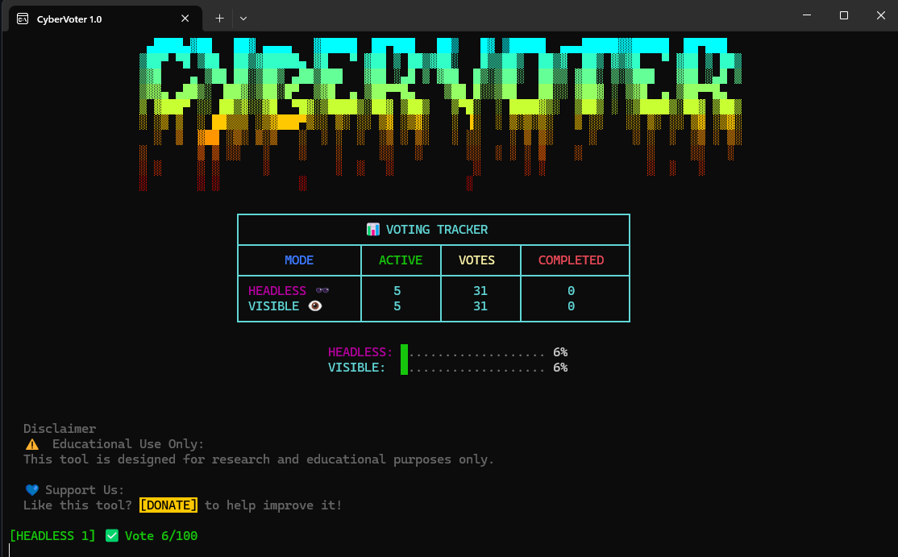

# 🗳️ CyberVoter

**CyberVoter** is a **secure, automated voting tool** developed by [AI Simplified](https://example.com) to streamline and automate online voting tasks with ease.

> ⚠️ This tool is intended for **personal, non-commercial** use only. See [EULA](#-legal) and [Disclaimer](#-legal).

---
## 📷 Preview

> *UI Preview – sleek, fast, and focused on automation.*

---
## 📥 Download

Visit the [Releases](https://github.com/learnaisimplified/cybervoter/releases) section and download:

- 🔽 **`cybervoter.exe`**

---

## 🚀 How to Run

1. Download `cybervoter.exe` from the [Releases](https://github.com/learnaisimplified/cybervoter/releases) page.
2. Right-click the file → **Properties** → Uncheck `Blocked` (if present).
3. Double-click to run.

> 🛡️ **If Windows SmartScreen appears**:
> - Click **"More info"**
> - Then click **"Run anyway"**
>
> This warning appears because the app is new and not yet widely recognized by Microsoft. It is digitally signed and safe to run.

---

## 🧪 VirusTotal Safety Check

This file has been scanned and verified on [VirusTotal](https://www.virustotal.com/gui/file/cd61b51e4a14540be5a47db810688304eeb658393078daa81645f3fb0b5b8c06/details):

- ✅ **Clean:** No detections from 70+ antivirus engines
- 🆔 **SHA-256:** `cd61b51e4a14540be5a47db810688304eeb658393078daa81645f3fb0b5b8c06`
- 📅 **Scan Date:** August 4, 2025

> ⚠️ SmartScreen or antivirus may still flag it due to its newness, not because it is harmful.

---

## 🖥️ System Requirements

| Requirement       | Details                    |
|-------------------|----------------------------|
| 🪟 OS              | Windows 10 or later (64-bit) |
| 📦 Installation    | None (standalone `.exe`)   |
| 🌐 Internet        | Required for some features  |

---

## 📜 Legal

- [EULA](./EULA.md)
- [Disclaimer](./DISCLAIMER.md)

© 2025 **AI Simplified**. All rights reserved.

---

## 🤝 Contributing

Pull requests are not open for this private project at this time.

---

## 📫 Contact

For questions, licensing, or enterprise use:  
📧 **contact@aisimplified.com**
